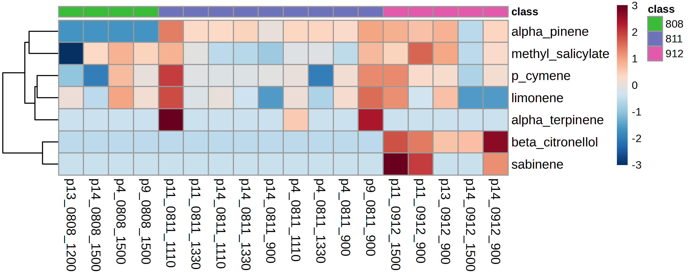
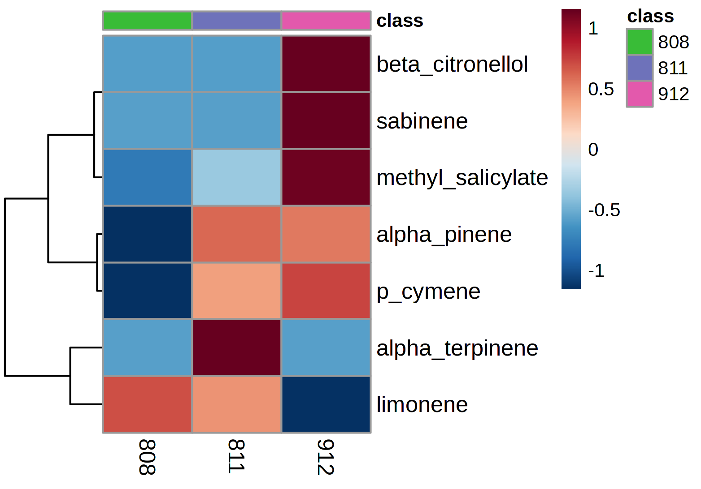
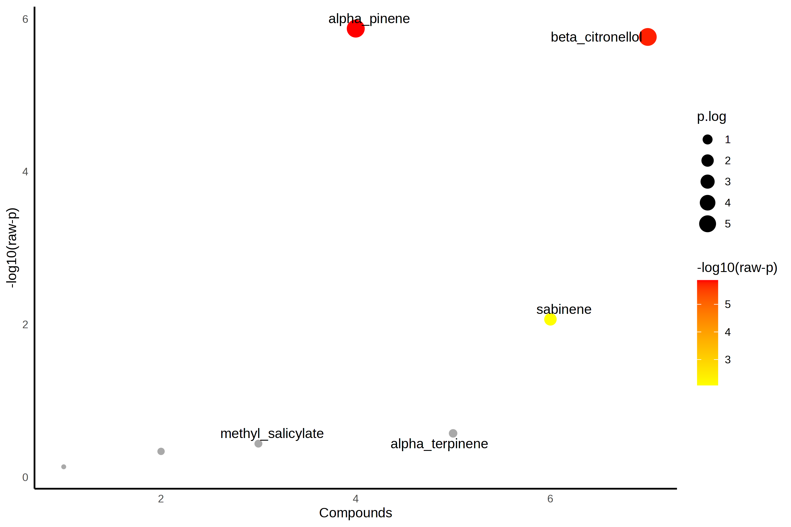
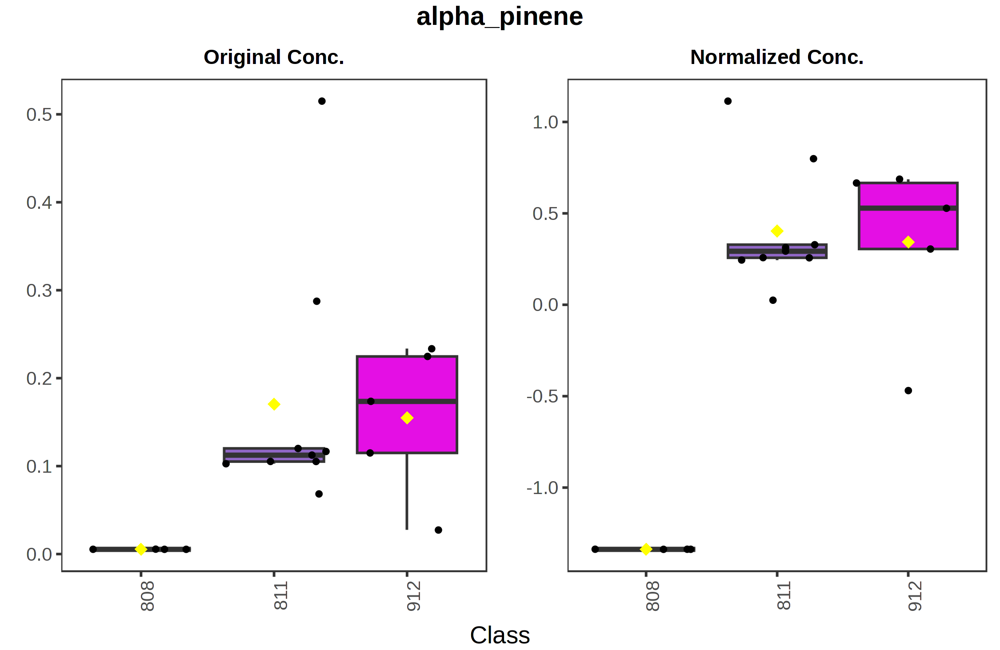
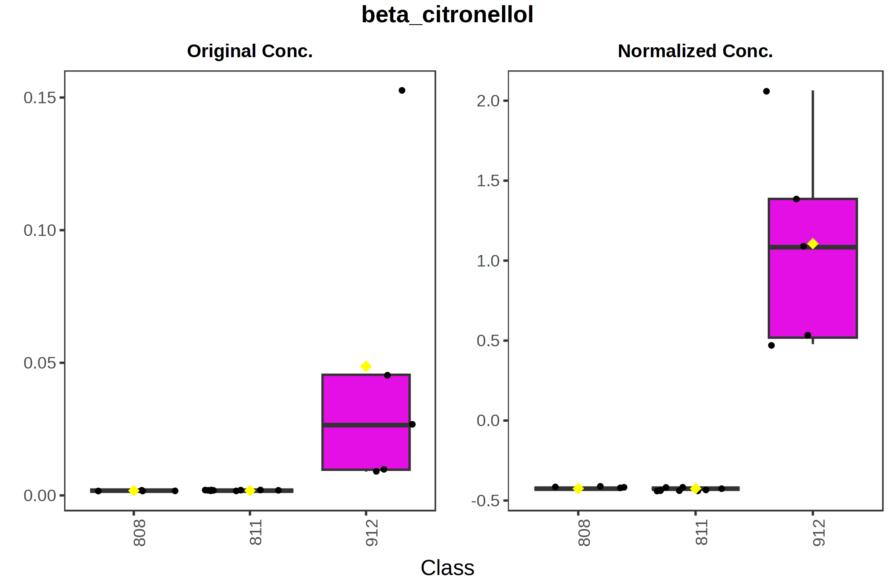
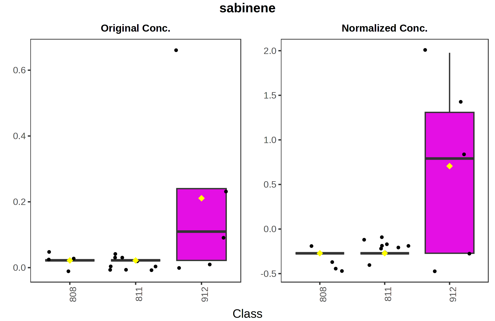

# Read Me!

Hi there! This is the summary from the University of British Columbia Sampling that was taken in August and September at the Pacific Spirit Regional Park.

Below is the general workflow for getting a basic summary from the data using R. 
Feel free to use this as a jumping off point for your own analysis.

## **In Brief**

On the whole, the level of compounds detected in these samples are lower than what we had found in previous sampling here in Missouri. This could be due to the location and the fact that the time between collection and analysis was approximately 10 months. In the future we will strive to keep our analysis within three months of sampling, but due to technical issues with the machinery and scientist availability that was not possible for this batch of samples.

The sampling design had originally intended for there to be an analysis of how the compounds vary based on time, however, some of the time points only had 2 pumps running at a time and low detection rates also mean there are not consistently readings for a compound on all three of the tubes. Thus, for this analysis we have just looked at how the compounds vary between the sampling days.

First the data was cleaned for quality and compound "hits" with a confidence of less than 70 were excluded from the analysis along with two tubes which had a total air volume of less than 1L.

The most frequently detected compound among the samples was methyl-salicylate with 17 occurrences among the total confident "hits". Together with alpha-pinene, p-cymene, and limonene, they make up 54.71% of the total "hits".

The compound which appeared consistently and with a relatively high concentration across the samples was limonene. This compound was in the top three concentration averages for each day sampled with concentrations ranging from 0.122 to 0.360 ug/m³.

Results from the ANOVA performed in MetaboAnalyst found that alpha-pinene, beta-citronellol, and sabinene were all significantly different between at least one sample at a FDR of 0.05. The boxplots for these compounds show that the September 12th sampling had more of each of these compounds than the other two days of sampling. Additionally, the heat maps confirm this observation and show the September 12th day to have higher relative amounts of these compounds.

Continue reading below if you would like to see how these conclusions were made and replicate it yourself!

# **Data Import and Cleaning**    

### Load in libraries :)
```{r}
library(tidyverse)
library(cowplot)
library(readxl)
theme_set(theme_cowplot())
library(factoextra)
library(wesanderson)
library(knitr)
library(gt)
library(openxlsx)
library(nlme)
library(lmtest)
library(AICcmodavg)
library(lattice)
pal <- wes_palette(name = "Zissou1")
```

### Read in data!
```{r}
phyto_dat <- read.csv("phyto_ubc_dat")

phyto_dat$time <- factor(phyto_dat$time, levels = c("900","1030", "1110", "1200", "1330", "1450", "1500")) #changing time to factor

phyto_dat <- phyto_dat|>
  mutate(day = str_pad(as.character(day), 4, pad = "0"))#day to character

glimpse(phyto_dat)

unique(phyto_dat$time)

pump_dat <- read_xlsx("tidy_pump_counts_ubc.xlsx", na = "na")

unique(pump_dat$time)

pump_dat$time <- factor(pump_dat$time,levels = c("900","1030", "1110", "1200", "1330", "1500")) #changing time to factor 

pump_dat$day <- as.character(pump_dat$day)

glimpse(pump_dat)
```

### Performing calculations on the pump data
```{r}
pump_dat <- pump_dat |>
  mutate(total_count = count_after-count_before, #pump count during sampling
         total_ml = total_count*ml_count, #ml collected
         total_l = total_ml/1000, #total liters collected
         cubic_m = total_ml/1000000) #total cubic meters collected

glimpse(pump_dat)
```

### Slap those files together
```{r}
dat_joined <- left_join(phyto_dat, pump_dat, by= c("pump", "day", "time", "location", "year"))
#joined on the shared columns

glimpse(dat_joined)
```

### Calculate the corrected concentrations based on the pump data
```{r}
dat <- dat_joined |>
  mutate(conc_ngcm = amount/cubic_m,
         conc_ugcm = conc_ngcm/1000,
         pca_id = case_when(

    type == "sample" ~ str_c(
      "sample", pump, time, location, day, year,
      sep = "_"
    ),

    type == "control" ~ str_c(
      "control", time, location, day, year,
      sep = "_"
    ),

    type == "blk" ~ str_c(
      blk_num, location, day, year,
      sep = "_"
    ),
    TRUE ~ NA_character_))
```
# LOD/LOQ Calculations

This provides information on the accuracy of our method and the detection level of the instrument itself.

```{r}
limits <- read_xlsx("LOD_LOQ_ubc.xlsx") |>
  mutate(lod = (3*concentration)/(signal/noise),
         loq = (10*concentration)/(signal/noise))
```


```{r}
#| echo: false
#| warning: false
#| message: false
#| tbl-cap: "LOD/LOQ of Compounds"

lodq <- limits |>
  subset(select = c(compound, lod, loq))

lodq |>
  gt() |>
  tab_header(title = "LOD/LOQ of Compounds") |>
  cols_label(compound = "Compound",
             lod = "LOD",
             loq = "LOQ") |>
  fmt_number(columns = c(lod, loq),
             decimals = 3)|>
  opt_row_striping()
```

# General Quality Control Checks and Data Filtering

Some of the tubes given to us did not have counts associated with them from which we could calculate the compound information accurately. The tube that was removed from the data set and is: p13_1500_0808. 

Additionally, all blanks and controls were filtered out for this summary.

```{r}
#removing blanks, controls, and p13_1500_0808
dat <- dat |>
  filter_out(type == "blk") |>
  filter_out(type == "control") |>
  filter_out(pca_id == "sample_p13_1500_psrp_0808_2025")
```

In the notes for sampling on August 8th (0808), there was a note saying that 

By looking at the liters of air collected in each sample we can see which pumps malfunctioned during the sampling.

We will exclude samples sample_p4_900_psrp_0912_2025 and sample_p4_1030_psrp_0808_2025 since they are both less than 1 liter of total volume. The other sample volumes range from 13L to 28L.

```{r}
#checking volume
pump_volume <- dat |>
  group_by(pump, time, day) |>
  summarise(volume = mean(total_l)) |>
  arrange(volume)

#removing samples with volume less than 1L
dat <- dat |>
  filter_out(pca_id == "sample_p4_900_psrp_0912_2025") |>
  filter_out(pca_id == "sample_p4_1030_psrp_0808_2025")
```

Q-value shows how well the m/z matched the ratios provided by the method. A good cutoff for a pilot study like this is 70. Thus, the compounds with a q-value of less than 70 will be filtered out. This ensures that the results we present are accurate.

```{r}
#filtering out results with a q-value of less than 70

dat <- dat |>
  filter_out(q_value < 70)
```

```{r}
#writing out a csv of this for UBC

#write_csv(dat, "corrected_cleaned_pump_results.csv")
```

Creating a paired down wideformat data frame for UBC
```{r}
wdat <- dat |>
  select(pump, time, day, location, peak_name, conc_ugcm) |>
  pivot_wider(names_from = peak_name, values_from = conc_ugcm)

#write_csv(wdat, "confirmed_concentrations_from_samples.csv")
```


## Checking how many compounds per day we have after the filtering

```{r}
#group by day and count compound names

evenness <- dat |>
  group_by(day) |>
  summarise(obscount = n())

print(evenness)
```

Our samples now have varying numbers of observations per day which will lead to downstream issues in statistical analysis.

# **Visualization!**

## Scatterplot of data (untransformed)
```{r}
dp <- dat |>
  ggplot(aes(x = day, y = conc_ugcm, color = pump)) +
  geom_point(position = position_jitter(width = 0.3),
             alpha = 0.5)

dp
```

## Histogram of data (untransformed)
```{r}
dphis <- dat |>
  ggplot(aes(x = conc_ugcm)) +
  geom_histogram(bins = 30)

dphis
```

## Log Transformation
```{r}
dat <- dat |>
  mutate(conc_nglog = log10(conc_ngcm),
         conc_uglog = log10(conc_ugcm))
```

### Reviewing data skew again (transformed)

```{r}
dphis2 <- dat |>
  ggplot(aes(x = conc_uglog)) +
  geom_histogram(bins = 30)

dphis2
```

# **Data Summaries**

## Daily Average

Kept compounds that had at least two observations within the day. They were sorted by day and then ordered least to greatest within each day.

```{r}
#grouped by day and compound name, then counted the number of observations for that compound in each day
#summarized that info along with the mean, median, and stdv of each compound within a day.
#filtered out any compounds that had less than 2 observations
#arranged largest to smallest

daily_avg <- dat |>
  group_by(day, peak_name) |>
  summarize(obs_num = n(),
            conc_average_ugcm = mean(conc_ugcm),
            conc_median_ugcm = median(conc_ugcm),
            conc_stdv_ugcm = sd(conc_ugcm),
            .groups = "drop_last") |>
  filter_out(obs_num < 2) |>
  arrange(desc(conc_average_ugcm))

```

Creating table with daily averages of the compounds
```{r}

#| echo: false
#| warning: false
#| message: false
#| tbl-cap: "Daily Average of Compounds"

daily_avg |>
  gt() |>
  tab_header(
    title = "Daily Average of Compounds",
    subtitle = "in micrograms per meter cubed (ug/m³)")|>
  cols_label(peak_name = "Compound",
             obs_num = "n",
             conc_average_ugcm = "Mean (µg/m³)",
             conc_stdv_ugcm = "SD (µg/m³)",
             conc_median_ugcm = "Median (µg/m³)") |>
  fmt_number(columns = c(conc_average_ugcm, conc_stdv_ugcm, conc_median_ugcm),
             decimals = 3)|>
  opt_row_striping()


```

## Box Plot of Compounds Organized by Day
Note: Compounds with only one observation were kept for this visualizion.

### August 8th 2025 (untransformed)
```{r}
aug_8th_boxplots <- dat |>
  filter(day == "0808") |>
  ggplot(aes(x = peak_name, y = conc_ugcm, color = peak_name)) +
  geom_boxplot() +
  geom_point(position = position_jitter(width = 0.2),
             alpha = 0.5,
             size = 2) +
  theme(axis.text.x = element_text(angle = 90), legend.position = "none") +
  labs(title = "August 8th Compounds",
       x = "Compound Name",
       y = "Concentration (µg/m³)")

aug_8th_boxplots
```

### August 8th 2025 (log transformed)
```{r}
aug_8th_boxplots_log <- dat |>
  filter(day == "0808") |>
  ggplot(aes(x = peak_name, y = conc_uglog, color = peak_name)) +
  geom_boxplot() +
  geom_point(position = position_jitter(width = 0.2),
             alpha = 0.5,
             size = 2) +
  theme(axis.text.x = element_text(angle = 90), legend.position = "none") +
  labs(title = "August 8th Compounds (log transformed)",
      x = "Compound Name",
      y = "Log Tranformed Concentration")

aug_8th_boxplots_log
```

### August 11th 2025 (untransformed)
```{r}
aug_11th_boxplots <- dat |>
  filter(day == "0811") |>
  ggplot(aes(x = peak_name, y = conc_ugcm, color = peak_name)) +
  geom_boxplot() +
  geom_point(position = position_jitter(width = 0.2),
             alpha = 0.5,
             size = 2) +
  theme(axis.text.x = element_text(angle = 90), legend.position = "none") +
  labs(title = "August 11th Compounds",
       x = "Compound Name",
       y = "Concentration (µg/m³)")

aug_11th_boxplots
```

### August 11th 2025 (log transformed)
```{r}
aug_11th_boxplots_log <- dat |>
  filter(day == "0811") |>
  ggplot(aes(x = peak_name, y = conc_uglog, color = peak_name)) +
  geom_boxplot() +
  geom_point(position = position_jitter(width = 0.2),
             alpha = 0.5,
             size = 2) +
  theme(axis.text.x = element_text(angle = 90), legend.position = "none") +
  labs(title = "August 11th Compounds (log transformed)",
      x = "Compound Name",
      y = "Log Tranformed Concentration")

aug_11th_boxplots_log
```

### September 12th 2025 (untransformed)
```{r}
sept_12th_boxplots <- dat |>
  filter(day == "0912") |>
  ggplot(aes(x = peak_name, y = conc_ugcm, color = peak_name)) +
  geom_boxplot() +
  geom_point(position = position_jitter(width = 0.2),
             alpha = 0.5,
             size = 2) +
  theme(axis.text.x = element_text(angle = 90), legend.position = "none") +
  labs(title = "September 12th Compounds",
       x = "Compound Name",
       y = "Concentration (µg/m³)")

sept_12th_boxplots
```

### September 12th 2025 (log transformed)
```{r}
sept_12th_boxplots_log <- dat |>
  filter(day == "0912") |>
  ggplot(aes(x = peak_name, y = conc_uglog, color = peak_name)) +
  geom_boxplot() +
  geom_point(position = position_jitter(width = 0.2),
             alpha = 0.5,
             size = 2) +
  theme(axis.text.x = element_text(angle = 90), legend.position = "none") +
  labs(title = "September 12th Compounds (log transformed)",
      x = "Compound Name",
      y = "Log Tranformed Concentration")

sept_12th_boxplots_log
```
### Interpretation of Daily Averages 

+ Limonene is among the top three compounds for each of the three days with a ug/m³ ranging from 0.122 on August 8th, 0.241 on September 12th, and 0.360 on August 11th.
  + ppb equivalents for this compound are 0.0219 ppb, 0.0433 ppb, and 0.0646 ppb.
+ The compound with the highest observed reading is Beta-phellandrene, which had a reading of 1.236 ug/m³ on August 11th.
  + ppb equivalents for this is 0.222 ppb
+ The lowest level observed compounds varied depending on the day of sampling with ranges near 0.009 ug/m³ (for compounds like fenchone on August 8th and beta-pinene on August 11th) while the lowest reading for September 12th was alpha-terpinene at 0.048.
  + ppb for fenchone: 0.0015 ppb, beta-pinene: 0.0016 ppb, alpha-terpinene: 0.0086 ppb.

**August 8th 2025**

+ Top three compounds for the day:
  + limonene
  + alpha-pinene
  + p-cymene
  
**August 11th 2025**

+ Top three compounds for the day:
  + beta-phellandrene
  + limonene
  + beta-myrcene

**September 12th 2025**

+ Top three compounds for the day:
  + cis-3-hexen-1-ol
  + sabinene
  + limonene

Due to the low number of observations for some of these compounds there is a high amount of variability and thus, these concentrations should be taken as a starting point from which to work and frame future results on.

## Compound Identification Frequency

While averages tell us how much of the compound was observed, detection frequency lets us see how often that compound was identified across our samples.

```{r}
#counted the number of observations from the data set. These are the observations with a q-value equal to or greater than 70
#grouped by compound name, and counted the number of rows (e.g. samples it is in) then arranged largest to smallest.
total_samples <- nrow(dat)

det_freq <- dat |>
  group_by(peak_name) |>
  summarise(obs_num = n(),
            freq = (obs_num/total_samples)*100) |>
  arrange(desc(obs_num))

```

Table with detection frequency information

```{r}
#| echo: false
#| warning: false
#| message: false
#| tbl-cap: "Detection Frequency"

det_freq |>
  gt() |>
  tab_header(
    title = "Detection Frequency",
    subtitle = "total observations: 117")|>
  cols_label(peak_name = "Compound",
             obs_num = "n",
             freq = "Frequency %") |>
  fmt_number(columns = c(freq),
             decimals = 2)|>
  opt_row_striping()
```

Detection Frequency Bar Chart
```{r}
det_barchart <- det_freq |>
  ggplot(aes(x = fct_reorder(peak_name, freq), y = freq)) + #groups and orders by frequency value
  geom_col() +
  theme( axis.text.x = element_text(
    angle = 90)) +
  labs(title = "Detection Frequency",
       x = "Compound Name",
       y = "Frequency (%)")

det_barchart
```

### Interpretations of Detection Frequencies

+ Together, methyl-salicylate, alpha-pinene, p-cymene, and limonene make up 54.71% of the identified compounds.

+ The other 21 compounds making up the rest of the detection frequency.

# Statistical Analysis

## Getting a table to put into MetaboAnalyst to create heatmaps

To input into MetaboAnalyst, we first filtered out any observations that had less than three observations of that compound within each day.

```{r}
metabo <- dat |>
  group_by(day, peak_name) |>
  mutate(obs_num = n()) |>
  filter_out(obs_num < 3) |>
  select(day, time, peak_name, conc_ugcm, pump) |>
  pivot_wider(names_from = peak_name, values_from = conc_ugcm) |>
  rename(group = day)|>
  mutate(id = str_c(pump, group, time, sep = "_")) |>
  relocate(id, .before = 1)
 
metabo$time <- NULL #removes unneeded time column
metabo$pump <- NULL #removes unneeded pump column
  
write.csv(metabo, file = "metabo_ubc.csv")
```

Steps for putting this into MetaboAnalyst:
Open up the csv in excel and remove the first row of numbers.

+ www.metaboanalyst.ca
+ choose "click here to start"
+ Choose "Statistical Analysis One Factor"
+ Upload .csv to metaboanalyst as samples in rows, unpaired.
+ It should say there are 7 compounds, with 3 groups, and 18 samples. Click "proceed"
+ Under data filtering click "proceed"
+ Since we have missing data, choose left-censored data estimation which will replace "NA" with a LOD 1/5 the min positive value.
+ Normalization: Choose log transformation base 10 and Pareto scaling, hit normalize and view results to see the change. Then click "proceed"

### Heatmaps from Metaboanalyst

Options:

+ chose "do not cluster"


Options:

+ chose "do not cluster" and "Show only group averages"



### ANOVA from MetaboAnalyst

Alpha-pinene, beta-citronellol, and sabinene were significantly different between the days using an FDR cutoff of 0.05.



Inputting feature table from ANOVA test
```{r}
posthoc <- read.csv(file = "anova_posthoc (1).csv")
```

```{r}
#| echo: false
#| warning: false
#| message: false
#| tbl-cap: "ANOVA Posthoc Results"

posthoc |>
  gt() |>
  tab_header(
    title = "ANOVA Posthoc Results",
    subtitle = "FDR cutoff of 0.05")|>
  opt_row_striping()
```

## Individual Boxplots from the Post-hoc tests

**Alpha-Pinene**




**Beta-Citronellol**




**Sabinene**



### Thanks for reading! Let me know if you have any quesitons.